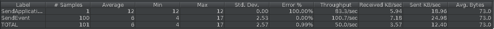
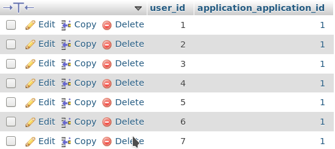
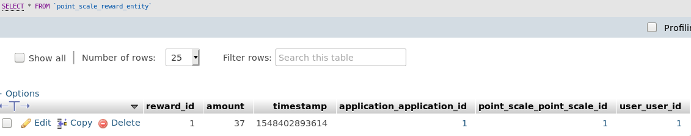
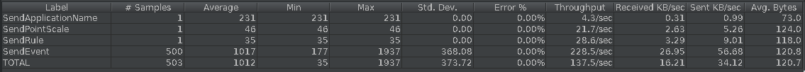

# Teaching-HEIGVD-AMT-2018-Testing-Non-Functional-Concurrency
## Introduction

The idea is to find use where some concurrency issues appear.
We can imagine these scenarios :

1) A new user arrives and sends at the same time more than one event. On server side, when a user who is not registered yet in the database arrives, then he will be registered in the database. Then the potential problem is that this user will possibly be registered twice, or more if there are more requests.
2) More than one event triggering the same stateful rule arrive at the same time. For instance let's imagine a rule where the user earns a shiny badge when his amount of a given pointScale is 10. Then we can have concurrency issues when the pointScale amount goes from 9 to 10.

## Test with JMeter

1) We tested the following scenario:
- we start with an empty database
- we send an api key to the server to be able the send other requests
- we set 100 threads to send an event with the same user id.

As we can see there are 7 new users created while only 1 user made the requests. After a few tests we have between 6 and 9 users created.

2) We wrote another test doing the following steps :
- start with an empty database
- send an api key to the server
- send a PointScale called headshot
- then send the following rule stating this : "when a user send an event called headshot he earns +1 on his scalepoint reward headshot"
- finally send 500 threaded events headshot from the same user and check if he actually has 500 on the headshot reward scalepoint counter. After having ran the test a few times we have seen that the actual number of headshot reward scalepoint goes from 20 to 50.

Since we have more writing than reading, we tried to apply a pessimistic strategy. It's slower than the optimistic strategy but we don't need to manage exceptions. However we weren't actually able to implement one of these strategy.
